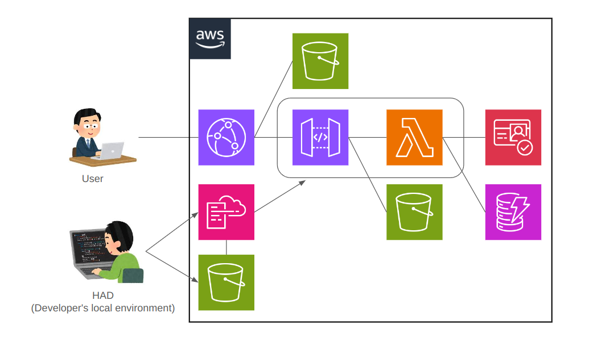

# HAD
## Overview
HAD (h-akira AWS Deployer) is a framework to develop and deploy serverless web applications on AWS.  
  
HAD creates the CloudFormation stack and builds API Gateway and Lambda.
The source code of Lambda is also automatically generated by HAD. 
Other resources such as CloudFront, DynamoDB, Cognito, etc. are basically built outside of HAD.
However, they can be optionally added to the HAD by adding an arbitrary yaml file to the CloudFormation template.
## Usage
Plese read Wiki for instructions on using HAD. (Japanese version only)
